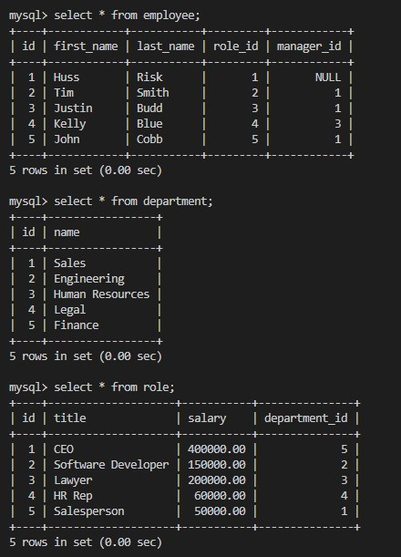
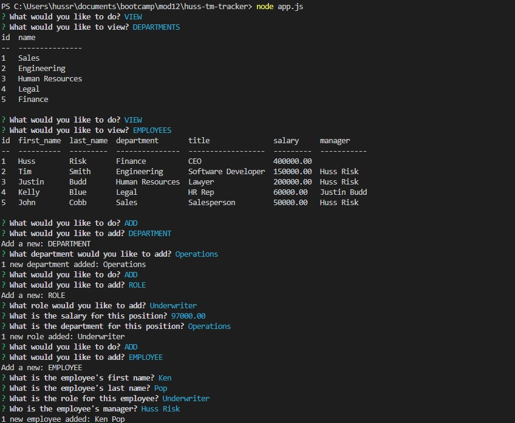
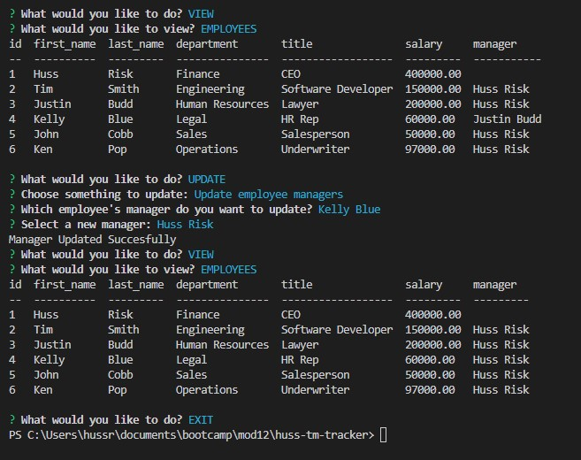

# Huss-TM-Tracker

## Table of Contents: 
* [Description](#Description)
* [Actions Taken](#Actions)
* [Screen Shot](#Screen)
* [Links](#Links)

## Description
To create a Node.js command-line application with MySQL that allows non-developers to easily view and interact with information stored in databases. The user will be able to use the team member (TM)/ employee tracker to add, delete, update and view the information stored on this database, which is known as a "Content Management System" (CMS). 

## Actions Taken
* Used Inquirer package to prompt the user with a series of prompts regarding which data would like to be viewed/modified/deleted (departments, employees, role ID, etc.) via the command-line interface. 
* Used MySQL for the database management interface to create the employees database with tables that "join" to other tables linked with IDs. 
* Used console.table to print the rows in the MySQL console.  
* Was able to complete the bonus items except for utilized budget. 

## Screen Shot

 
 
 
 
## Links

Video Link: https://drive.google.com/file/d/1q97QG-vHDVZVj9DNn06G8xSLmbgU5VMC/view

GitHub Link: https://github.com/hussrizk56/Huss-TM-Tracker
